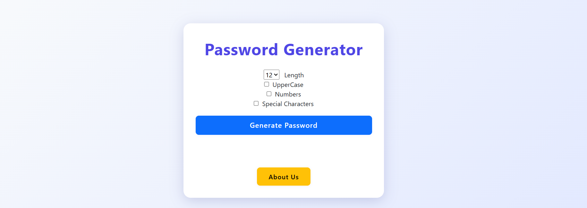
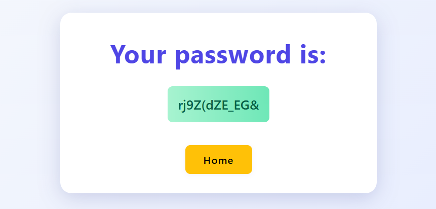
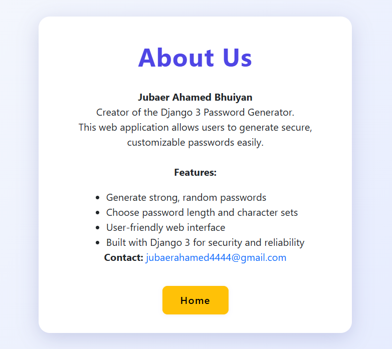

# Django 3 Password Generator

A modern, secure, and customizable password generator web application built with Django 3.

## Features

- Generate strong, random passwords
- Choose password length (6–14) and character sets (uppercase, numbers, special characters)
- Simple, user-friendly web interface with a professional look (Bootstrap 5)
- Responsive design for desktop and mobile
- Built with Django 3 for security and reliability

## Screenshots





## Getting Started

### Prerequisites

- Python 3.6 or higher
- pip (Python package manager)
- Django 3.x

### Installation

1. **Clone the repository:**
   ```powershell
   git clone https://github.com/jubaer-bhuiyan/django3-password-generator.git
   cd django3-password-generator
   ```

2. **Install dependencies:**
   ```powershell
   pip install -r requirements.txt
   ```

3. **Run migrations:**
   ```powershell
   python manage.py migrate
   ```

4. **Start the development server:**
   ```powershell
   python manage.py runserver
   ```

5. **Open your browser:**
   Go to [http://127.0.0.1:8000/](http://127.0.0.1:8000/)

## Usage

- Select your desired password options (length, uppercase, numbers, special characters)
- Click "Generate Password" to receive a secure password
- Use the "About Us" page to learn more about the project and the author

## Project Structure

```
passwordGenaratorProject/
│
├── generator/
│   ├── migrations/
│   ├── static/
│   ├── templates/
│   │   └── generator/
│   │       ├── aboutUs.html
│   │       ├── home.html
│   │       └── password.html
│   ├── __init__.py
│   ├── admin.py
│   ├── apps.py
│   ├── models.py
│   ├── tests.py
│   ├── urls.py
│   └── views.py
│
├── passwordGenarator/
│   ├── __init__.py
│   ├── asgi.py
│   ├── settings.py
│   ├── urls.py
│   └── wsgi.py
│
├── db.sqlite3
├── manage.py
└── README.md
```

## Author

**Jubaer Ahamed Bhuiyan**  
[LinkedIn](https://www.linkedin.com/in/jubaer-bhuiyan/)  
Email: [jubaerahamed4444@gmail.com](mailto:jubaerahamed4444@gmail.com)

## Contributing

Contributions are welcome! Please open an issue or submit a pull request.

## License

This project is licensed under the MIT License.